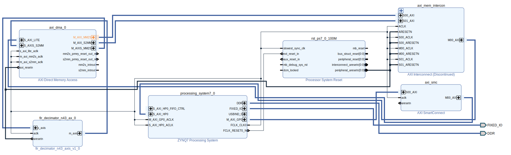
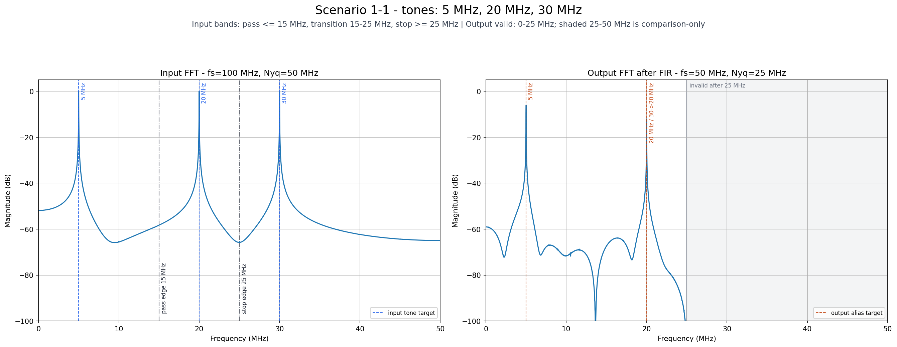
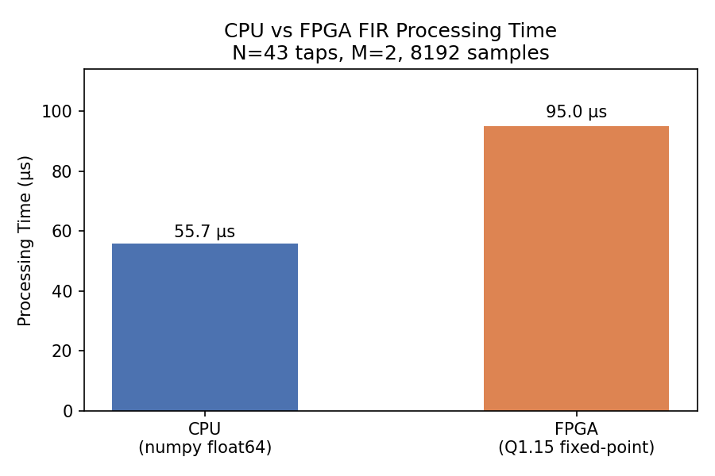

# zynq-axi-fir-decimation-ip

N=43 FIR decimation IP를 설계하고, Zynq-7000 실보드에서 end-to-end로 검증한 프로젝트.

*[🇬🇧 Full English version below](#english)*

100 MS/s로 들어오는 16-bit 스트림을 anti-aliasing 필터링과 함께 50 MS/s로 낮추는
FIR decimator를 — 사양 정의, Python 골든모델, Verilog RTL, AXI-Stream/DMA 기반
PS-PL 시스템 통합, SD 부팅 실보드 데모, 골든모델과의 비트 단위 자동 판정까지 —
한 학기 동안 1인으로 완주했다. 여기에 CPU 벤치마크, Fmax 스윕, ASIC 합성 교차 검증,
보드 전력 실측을 더해 하나의 RTL을 성능·전력·면적 관점에서 다각도로 평가했다.

```
PC(Python) → UART → PS bare-metal C → AXI DMA → PL FIR/decimator
                                                      ↓
PC FFT plot / 자동 판정 ← UART ← DDR ← AXI DMA S2MM ←─┘
```



## 결과 요약

| 항목             | 결과                                                                                                   |
| ---------------- | ------------------------------------------------------------------------------------------------------ |
| 실보드 기능 검증 | 보드 출력 4096샘플 vs 골든모델 — SNR 74.9 dB, max error 6 LSB, correlation 1.000000, PASS             |
| 처리 시간        | 8192샘플 85.0 µs (이론 한계 81.92 µs 대비 오차 3.8%), CPU numpy(221.0 µs) 대비 2.6×                |
| Fmax             | v1 116 MHz → 크리티컬 패스 분석 후 재설계(v2) 146 MHz, +26% — 두 버전 모두 보드 동작 확인            |
| ASIC 교차 검증   | 같은 RTL을 250nm 표준셀로 합성하면 v1 ≈ v2 동률 — 26% 이득이 FPGA 물리 구조에 종속된 최적화임을 실증 |
| 전력             | 보드 5V 입력 실측 2.21 W — Vivado 추정 1.705 W와 차이 요인을 실측으로 분해해 정합 확인                |





상세 수치와 근거:

- [보드 검증](docs/report/fir_n43/summary/scenario1_1.md)
- [FPGA Fmax 스윕](vivado/reports/sweep_summary_v2.md)
- [ASIC vs FPGA](docs/report/fir_n43/summary/asic_vs_fpga.md)
- [전력 실측 vs 추정](docs/report/fir_n43/summary/power_board_vs_vivado.md)

## 이 레포가 흔한 FIR 레포와 다른 점

**1. 검증이 주인공이다.** 골든모델과 RTL의 비트 단위 일치에서 출발해, 인터페이스
강건성 테스트벤치, 보드 출력 자동 판정까지 계층적 검증 파이프라인을 갖췄다. 데드락
버그를 고칠 때는 새 테스트벤치를 수정 전 RTL에 먼저 돌려 예측한 임계값과 정확히
일치하는 실패를 재현한 뒤에 수정했다 — 테스트가 버그를 실제로 잡는다는 것부터
증명하는 방식이다 (`docs/log/43`–`44`).

**2. 실제 하드웨어에서만 만나는 문제들의 근본 원인을 끝까지 추적했다.** 모든 DMA
전송이 멈춘 원인은 전송량 16,384바이트가 DMA 기본 length field(14-bit) 한계를
정확히 1바이트 초과한 것이었다. 스모크 테스트로 문제를 격리하고, 원인을 규명하고,
회귀로 재발을 막는 전 과정이 기록되어 있다 (`docs/log/31`–`32`).

**3. 같은 RTL을 두 구현 타겟에서 조명했다.** FPGA에서 Fmax를 26% 올린 파이프라인
분할이 ASIC 표준셀 합성에서는 아무 차이를 만들지 못한다. 동일 제약 스윕으로 이를
실증했고, 같은 병목 경로를 FPGA CARRY4는 8.66 ns에, 표준셀 합성기는 재구조화로
5.72 ns에 처리하는 것이 그 이유다 — 최적화는 아키텍처가 아니라 타겟에 속한다
(`asic/oasys/results/sweep_report.md`).

**4. 과정 전체가 재현 가능하게 남아 있다.** 사양 결정부터 실측까지 50편의 개발
로그(`docs/log/`)와 재현 스크립트가 있고, 빌드 산출물은 명령 재실행만으로 같은
경로에 재생성된다.

## Requirements

- **시뮬레이션/모델 검증**: `uv`(Python 3.13) + `iverilog`(11 이상) + `make` — 보드 불필요
- **보드 데모**: Zybo Z7-20 (Zynq-7020) + SD 카드 + USB-UART. 배포 이미지는
  `release/`에 포함되어 있어 **빌드 없이 바로 실행 가능**
- **재빌드(선택)**: Vivado / Vitis Embedded 2024.2 — 상세는
  [docs/getting_started.md](docs/getting_started.md)

## Quick Start

```bash
# Python 모델·RTL 시뮬레이션 (보드 불필요)
uv sync && uv run pytest -q
cd sim && make run_all && cd ..

# 보드 데모: release/v2_145mhz/BOOT.bin을 FAT32 SD 루트에 복사 → 부팅 → READY FIR 확인 후
uv run python sw/fir_decimator_demo.py --mode 1-1 --port /dev/ttyUSB1 --timeout 30
```

빌드부터 보드 데모까지 전체 절차: **[docs/getting_started.md](docs/getting_started.md)**

## Repository Map

| Path                         | Purpose                                                 |
| ---------------------------- | ------------------------------------------------------- |
| `model/`                   | Python float/fixed-point 레퍼런스 모델                  |
| `rtl/transposed_form/n43/` | 메인 N=43 FIR/decimator RTL (v1/v2)                     |
| `sim/`                     | Python·RTL 테스트, AXIS 회귀 스위트                    |
| `vivado/`                  | Block design·bitstream 재생성 Tcl, Fmax 스윕 리포트    |
| `vitis/`                   | bare-metal app·BOOT 이미지 빌드 스크립트               |
| `sw/`                      | PS C 애플리케이션 + PC Python UART/FFT 데모             |
| `asic/`                    | Oasys 합성 스윕 (config·결과·P&R 절차)                |
| `boards/`                  | Digilent Zybo Z7-20 보드 파일 (Vivado 재빌드용)         |
| `release/`                 | 검증된 SD boot 이미지 (BOOT.bin — 빌드 없이 데모 가능) |
| `docs/`                    | 사양·검증 요약·개발 로그·워크플로우                  |

`build/`는 로컬 빌드 산출물 디렉토리로 git에 추적되지 않는다 — 재현 규칙은
[docs/build_artifacts.md](docs/build_artifacts.md), 전체 구조 상세는
[docs/repository_structure.md](docs/repository_structure.md) 참고.

## Documentation

- [getting_started.md](docs/getting_started.md) — 빌드·데모·검증 재현 절차
- [project_pipeline.md](docs/project_pipeline.md) — 파이프라인 구조와 PASS 기준
- [build_artifacts.md](docs/build_artifacts.md) — 빌드 산출물 경로·재현 규칙
- [docs/report/fir_n43/summary/](docs/report/fir_n43/summary/) — 검증·비교분석 결과
- [docs/log/](docs/log/) — 의사결정·디버깅 기록 원본 50편 (사후 가공 없이 보존)
- [docs/workflow/](docs/workflow/) — 단계별 실행 계획 v1~v24 (각 시점의 목표·준비물·절차)

## Status

수행 기간 2026-03 ~ 2026-08, 1인 수행. 2026-07-22 기준 v1.0 — 기능 검증(시뮬레이션·
실보드), 성능(Fmax·CPU 대비), 보드 전력 실측, ASIC 합성 교차 검증까지 완료. 공개
자산화(기술 포스팅·데모 영상)와 최종 발표(2026-08-07)를 남겨둔 상태.
Zybo Z7-20 (Zynq-7020, xc7z020clg400-1), Vivado/Vitis 2024.2.

---

<a name="english"></a>

# zynq-axi-fir-decimation-ip

An N=43 FIR decimation IP designed from scratch and verified end-to-end on a real
Zynq-7000 board.

A FIR decimator that takes a 16-bit stream at 100 MS/s and downsamples it to 50 MS/s
with anti-aliasing filtering — carried solo through one semester, covering spec
definition, a Python golden model, Verilog RTL, AXI-Stream/DMA-based PS–PL system
integration, an SD-boot live board demo, and automatic bit-exact judgment against the
golden model. On top of that, a CPU benchmark, an Fmax sweep, ASIC synthesis
cross-checking, and on-board power measurement evaluate the same RTL from the
performance, power, and area angles.

```
PC(Python) → UART → PS bare-metal C → AXI DMA → PL FIR/decimator
                                                      ↓
PC FFT plot / auto-judge ← UART ← DDR ← AXI DMA S2MM ←┘
```

(Block design diagram, FFT result plot, and CPU-vs-FPGA timing chart: see the figures
in the Korean section above — plot labels are in English.)

## Results at a Glance

| Item                             | Result                                                                                                                                      |
| -------------------------------- | ------------------------------------------------------------------------------------------------------------------------------------------- |
| On-board functional verification | 4096 board output samples vs golden model — SNR 74.9 dB, max error 6 LSB, correlation 1.000000, PASS                                       |
| Processing time                  | 85.0 µs for 8192 samples (3.8% off the 81.92 µs theoretical limit), 2.6× faster than CPU numpy (221.0 µs)                               |
| Fmax                             | v1 116 MHz → redesign (v2) after critical-path analysis 146 MHz, +26% — both verified on the board                                        |
| ASIC cross-check                 | Synthesizing the same RTL on 250nm standard cells makes v1 ≈ v2 — proving the 26% gain is an optimization tied to FPGA physical structure |
| Power                            | 2.21 W measured at the board's 5V input — decomposed the gap against Vivado's 1.705 W estimate and confirmed consistency                   |

Details and evidence:

- [Board verification](docs/report/fir_n43/summary/scenario1_1.md)
- [FPGA Fmax sweep](vivado/reports/sweep_summary_v2.md)
- [ASIC vs FPGA](docs/report/fir_n43/summary/asic_vs_fpga.md)
- [Measured vs estimated power](docs/report/fir_n43/summary/power_board_vs_vivado.md)

## What Makes This Repo Different from a Typical FIR Repo

**1. Verification is the protagonist.** Starting from bit-exact agreement between the
golden model and RTL, the project builds a layered verification pipeline: interface
robustness testbenches, then automatic judgment of board output. When fixing a deadlock
bug, the new testbench was first run against the *pre-fix* RTL to reproduce a failure
exactly at the predicted threshold — proving the test actually catches the bug before
trusting the fix (`docs/log/43`–`44`).

**2. Root causes of problems that only appear on real hardware were chased to the end.**
The reason every DMA transfer hung: the 16,384-byte transfer exceeded the DMA's default
14-bit length-field limit by exactly one byte. Isolating with a smoke test, pinning the
cause, and guarding with regressions — the whole process is on record
(`docs/log/31`–`32`).

**3. The same RTL is examined on two implementation targets.** The pipeline split that
raised Fmax by 26% on the FPGA makes no difference in ASIC standard-cell synthesis. An
identical-constraint sweep proves it: the same bottleneck path takes 8.66 ns through
FPGA CARRY4 chains but 5.72 ns after the standard-cell synthesizer restructures it —
optimizations belong to the target, not the architecture
(`asic/oasys/results/sweep_report.md`).

**4. The whole process remains reproducible.** Fifty engineering logs (`docs/log/`)
from spec decisions to measurements, plus reproduction scripts; build artifacts
regenerate at the same paths just by re-running the commands.

## Requirements

- **Simulation / model verification**: `uv` (Python 3.13) + `iverilog` (11+) + `make` —
  no board needed
- **Board demo**: Zybo Z7-20 (Zynq-7020) + SD card + USB-UART. Pre-built boot images
  are included under `release/` — **no build required**
- **Rebuild (optional)**: Vivado / Vitis Embedded 2024.2 — see
  [docs/getting_started.md](docs/getting_started.md)

## Quick Start

```bash
# Python model & RTL simulation (no board needed)
uv sync && uv run pytest -q
cd sim && make run_all && cd ..

# Board demo: copy release/v2_145mhz/BOOT.bin to the root of a FAT32 SD card,
# boot, wait for "READY FIR", then:
uv run python sw/fir_decimator_demo.py --mode 1-1 --port /dev/ttyUSB1 --timeout 30
```

Full procedure from build to board demo:
**[docs/getting_started.md](docs/getting_started.md)** (Korean).

## Repository Map

| Path                         | Purpose                                                     |
| ---------------------------- | ----------------------------------------------------------- |
| `model/`                   | Python float/fixed-point reference models                   |
| `rtl/transposed_form/n43/` | Main N=43 FIR/decimator RTL (v1/v2)                         |
| `sim/`                     | Python & RTL tests, AXIS regression suite                   |
| `vivado/`                  | Block-design/bitstream rebuild Tcl, Fmax sweep reports      |
| `vitis/`                   | Bare-metal app & BOOT image build scripts                   |
| `sw/`                      | PS C application + PC Python UART/FFT demo                  |
| `asic/`                    | Oasys synthesis sweep (config, results, P&R procedure)      |
| `boards/`                  | Digilent Zybo Z7-20 board files (for Vivado rebuild)        |
| `release/`                 | Verified SD boot images (BOOT.bin — demo without building) |
| `docs/`                    | Specs, verification summaries, engineering logs, workflows  |

`build/` holds local build artifacts and is not tracked by git — see
[docs/build_artifacts.md](docs/build_artifacts.md) for reproduction rules and
[docs/repository_structure.md](docs/repository_structure.md) for the full layout.

## Documentation

Most documents are written in Korean; numbers, tables, commands, and plots are readable
without translation.

- [getting_started.md](docs/getting_started.md) — build, demo, and verification walkthrough
- [project_pipeline.md](docs/project_pipeline.md) — pipeline structure and PASS criteria
- [build_artifacts.md](docs/build_artifacts.md) — build artifact paths and reproduction rules
- [docs/report/fir_n43/summary/](docs/report/fir_n43/summary/) — verification and comparison results
- [docs/log/](docs/log/) — 50 raw decision/debugging logs (preserved without post-editing)
- [docs/workflow/](docs/workflow/) — step-by-step execution plans v1–v24

## Status

Mar–Aug 2026, solo project. v1.0 as of 2026-07-22 — functional verification
(simulation + board), performance (Fmax, vs CPU), on-board power measurement, and ASIC
synthesis cross-check complete. Remaining: public write-ups, demo video, and the final
presentation (2026-08-07).
Zybo Z7-20 (Zynq-7020, xc7z020clg400-1), Vivado/Vitis 2024.2.

## License

MIT — see [LICENSE](LICENSE).
