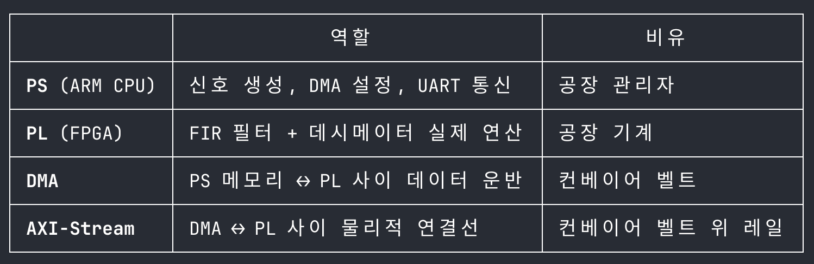

# 하드웨어 파이프라인

## 시나리오 1 — 기본 동작 시연

```
[PS: ARM Cortex-A9 / bare-metal C]
  C 코드로 멀티톤 신호 미리 생성 → DDR 메모리 저장
  (예: 5MHz + 20MHz + 30MHz, 필터 통과/차단 명확히 보여주는 조합 and 엣지 케이스)
        ↓ AXI DMA (DDR → PL, 100MHz)
[PL: FPGA — Verilog RTL]
  s_axis: AXI-Stream 입력
  FIR 필터 (N=43) + M=2 데시메이터
  m_axis: AXI-Stream 출력
        ↓ AXI DMA (PL → DDR, 50MHz)
[PS: ARM Cortex-A9 / bare-metal C]
  결과 버퍼 수신 → UART로 PC에 전송
        ↓ USB 시리얼 (UART)
[PC: Python]
  FFT 계산 → 입출력 파형 화면에 표시
```

## 시나리오 2 — 인터랙티브 시연

```
[청중]
  원하는 주파수 값 제시 (예: "10MHz, 40MHz")
        ↓ 키보드 입력
[PC: Python]
  주파수 값으로 멀티톤 입력 파형 즉시 계산 → 화면에 표시
  주파수 값(숫자 몇 바이트)을 UART로 전송
        ↓ USB 시리얼 (UART)
[PS: ARM Cortex-A9 / bare-metal C]
  주파수 값 수신 → 멀티톤 신호 즉석 생성 → DDR 메모리 저장
        ↓ AXI DMA (DDR → PL, 100MHz)
[PL: FPGA — Verilog RTL]
  s_axis: AXI-Stream 입력
  FIR 필터 (N=43) + M=2 데시메이터
  m_axis: AXI-Stream 출력
        ↓ AXI DMA (PL → DDR, 50MHz)
[PS: ARM Cortex-A9 / bare-metal C]
  결과 버퍼 수신 → UART로 PC에 전송
        ↓ USB 시리얼 (UART)
[PC: Python]
  FFT 계산 → 출력 파형 화면에 표시
```

## 역할 분담

| 위치    | 언어           | 역할                                         |
| ------- | -------------- | -------------------------------------------- |
| PC      | Python         | 키보드 입력, UART 통신, 입출력 파형/FFT 표시 |
| 보드 PS | C (bare-metal) | 신호 생성, DMA 제어, UART 송수신             |
| 보드 PL | Verilog        | FIR 필터 + 데시메이터 실제 연산              |

## 처리 방식

블록 처리 방식. 체감 지연 수백ms 이내.

시나리오 1은 fp/fs 경계에 걸친 고정 신호(5/20/30MHz)로 기본 동작과 엣지 케이스를 먼저 보여줌.
시나리오 2는 청중이 직접 주파수를 지정해서 필터 특성을 체험. UART로 주파수 값(숫자 몇 바이트)만 전송하므로 속도 문제 없음.

## 데모 포인트

fp=15MHz, fs=25MHz 필터 스펙을 눈으로 확인.

- 15MHz 이하 톤 → FFT에서 살아있음
- 25MHz 이상 톤 → FFT에서 사라짐


